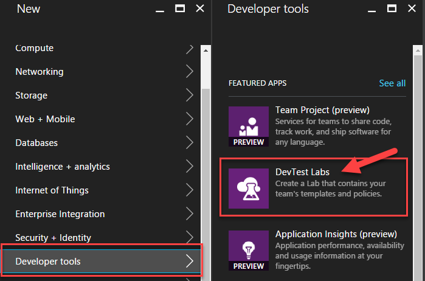
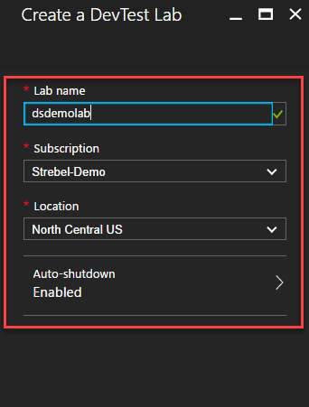
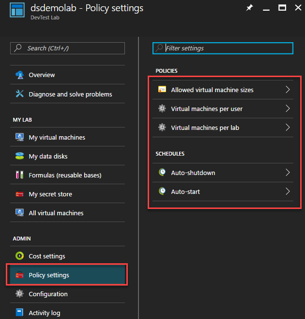
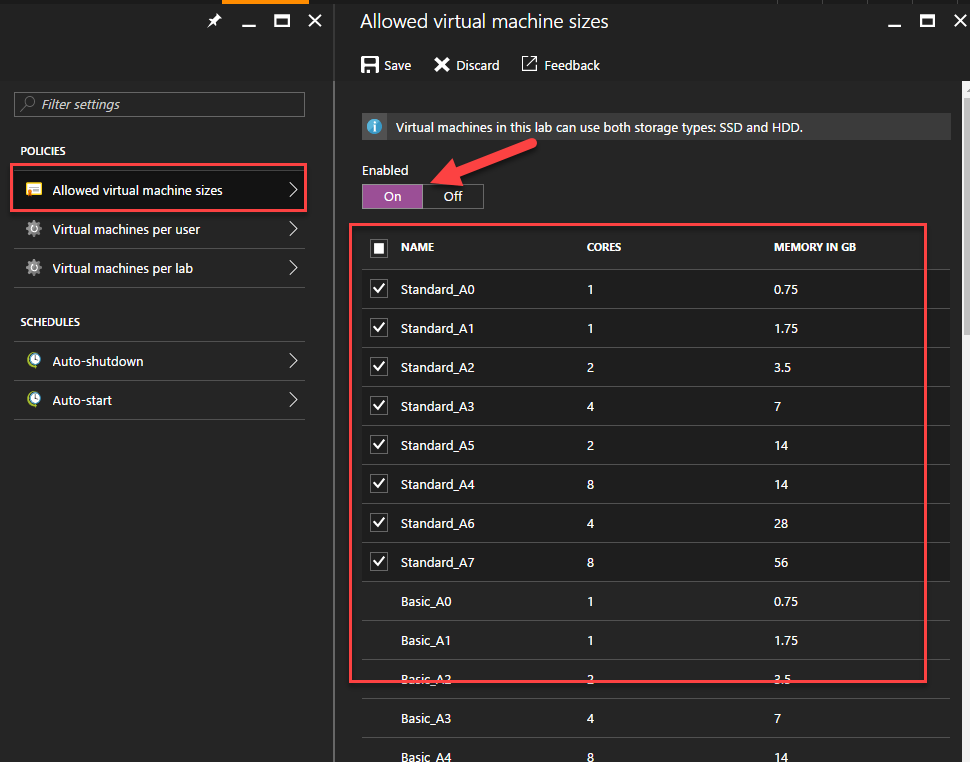
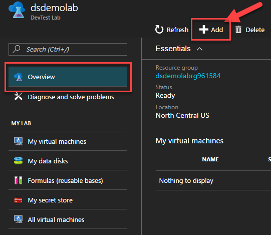
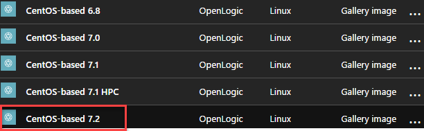
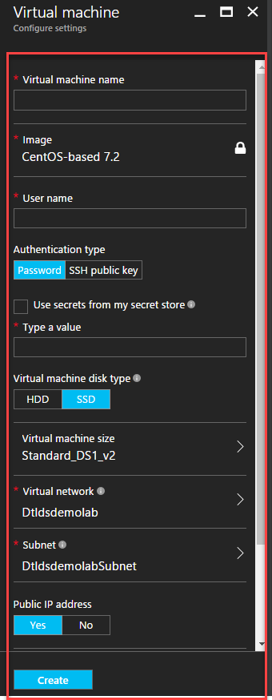

# Creating Dev\Test Labs

This lab will walk you through creating an Azure Virtual Network.
Azure DevTest Labs is a service that helps developers and testers
quickly create environments in Azure while minimizing waste and controlling cost.
You can test the latest version of your application by quickly provisioning Windows and Linux environments using reusable templates and artifacts.

## 1. Start
* On the left hand side of the Azure portal click "+New"
* Click "Developer Tools" and then Click "DevTest Labs"

* Enter Lab Name, Subscription, and Location

## 2. Modify Policy Settings

#### The folowing policies can be modified:
* Allowed Virtual Machines Sizes
* Virtual Machines per User
* Virtual Machines per Lab
* Auto-Shutdown and Auto-Start

## Modify Allowed Virtual Machine Sizes
* Select "Allowed Virtual machine sizes"
* Click Enabled "On"
* Limit to only "Standard A Series"
* Click Save

## 3. Create Virtual Machine

* Select "Overview"
* Click "Add"

* Select "CentOS 7.2"

* Fill in properties

