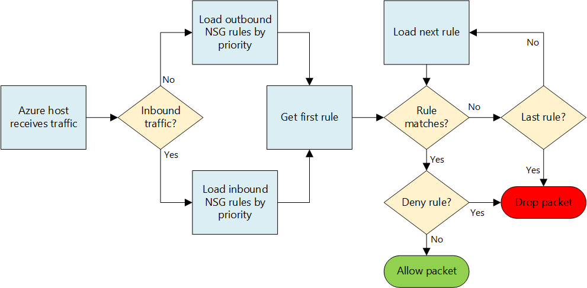
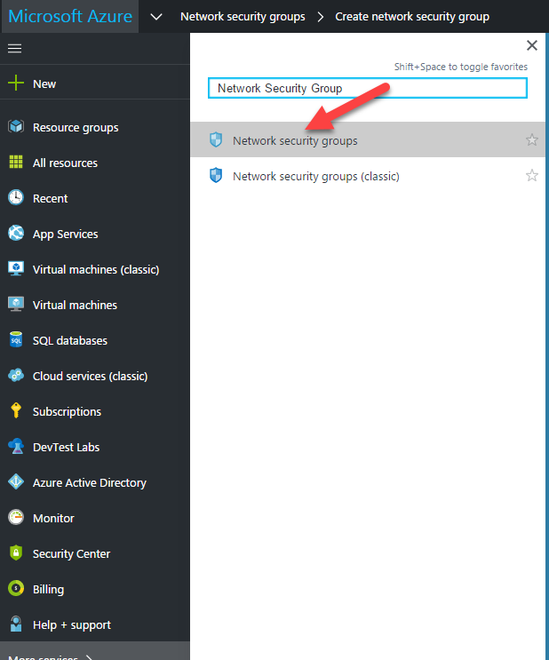

## Setup Network Security Groups

Network security group (NSG) contains a list of Access Control List (ACL) rules that allow or deny network traffic to your VM instances in a Virtual Network.
NSGs can be associated with either subnets or individual VM instances within that subnet.
When a NSG is associated with a subnet, the ACL rules apply to all the VM instances in that subnet.
In addition, traffic to an individual VM can be restricted further by associating a NSG directly to that VM.

### Network Security Group Diagram

## 1. Create NSG
* Browse "More Services"
* Search for "Network Security Group"
* Click "Network security groups)

* Click "Add"

* Enter Name, Subscription, Existing Resource Group, and Location.

* Select newly created NSG
* Select "Inbound Rules"
* Click "Add"

### Enter NSG Configuration

* Name - NSG "RDP"
* Source - "VPN Subnet IP Range"
* Service - "RDP"
* Action - "Allow"

****You can also add a deny all rule if you only want to let RDP through***

