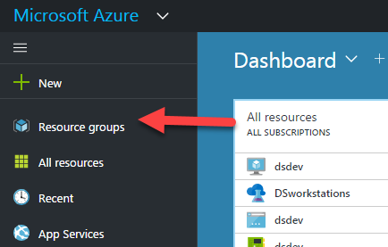
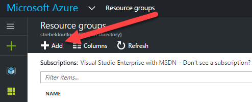
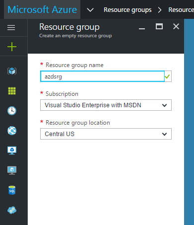

# Creating an Azure Resource Group

This lab will walk you through creating an Azure Resource Group. An Azure Resource Group
is a “lifecycle boundary,” because when resources share a resource group, their lifecycles (from create, to update, to delete) are managed in an integrated way. 
Use resource groups to collect and manage all your application resources.

## 1. Start
* Navigate your browser to http://portal.azure.com
* On the left hand side of the Azure Portal click "Resource Groups"

* Click "Add" Resource Group

* Enter Resource Group Name, Subscription, and Location

* Click "Create"

