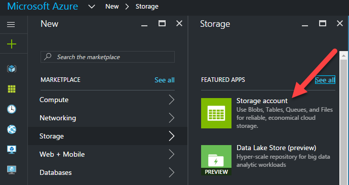
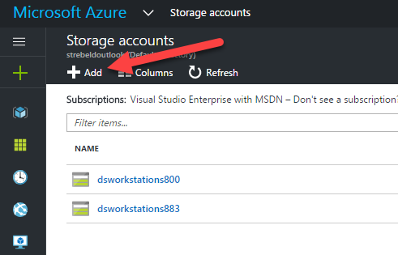
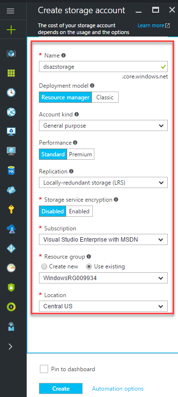

# Creating an Azure Storage Account
Azure storage provides the following four services: Blob storage, Table storage, Queue storage, and File storage.

* Blob Storage stores unstructured object data. A blob can be any type of text or binary data, such as a document, media file, or application installer. Blob storage is also referred to as Object storage.
* Table Storage stores structured datasets. Table storage is a NoSQL key-attribute data store, which allows for rapid development and fast access to large quantities of data.
* Queue Storage provides reliable messaging for workflow processing and for communication between components of cloud services.
* File Storage offers shared storage for legacy applications using the standard SMB protocol. Azure virtual machines and cloud services can share file data across application components via mounted shares, and on-premises applications can access file data in a share via the File service REST API.
* An Azure storage account is a secure account that gives you access to services in Azure Storage. Your storage account provides the unique namespace for your storage resources. The image below shows the relationships between the Azure storage resources in a storage account

### Create storage account
* Select "+New"
* Select "Storage"
* Click "Storage Account"

* Click "Add"

### Enter Storage Details
* Name - "COMPANY NAMING SCHEME"
* Deployment Model - "Resource Manager"
* Account Kind - "General Purpose"
* Performance - "Standard"
* Replication - "LRS"
* Storage Encryption - "Disabled"
* Subscription - " YOUR SUBSCRIPTION"
* Resource group - "Use Existing"
* Location - "Default"

* Click "Create"