# Creating a Virtual Machine via the Azure Portal

This lab will walk you through creating a virtual machine in Azure by
using the web portal. For one-time usage, or for learning about new
features, this works well. For a repeatable process, you’ll want to
automate your deployments by using PowerShell and Azure Resource Manager
(ARM) Templates. For now, let’s log on to the Azure Portal as we did in
the first look section and create a virtual machine

## 1. Start
* Navigate your browser to http://portal.azure.com
* On the left hand side of the Azure Portal click *+New*

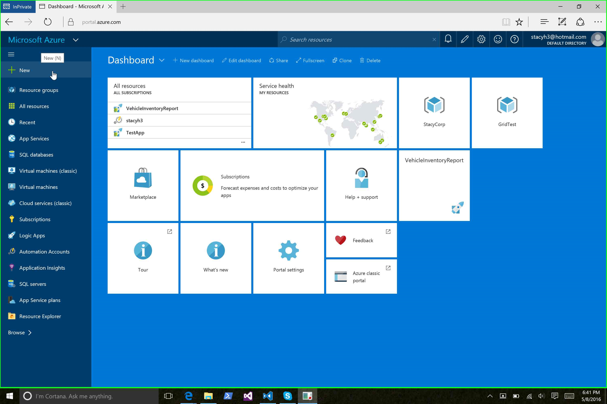

* Click *Virtual Machine*

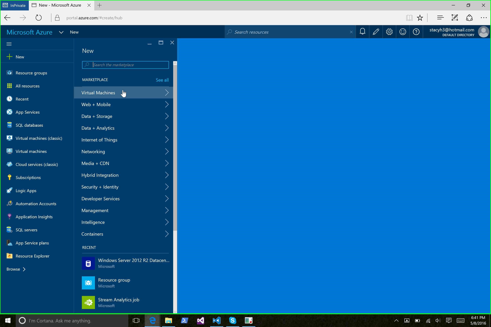

* Click *Windows Server 2012 R2 Datacenter*

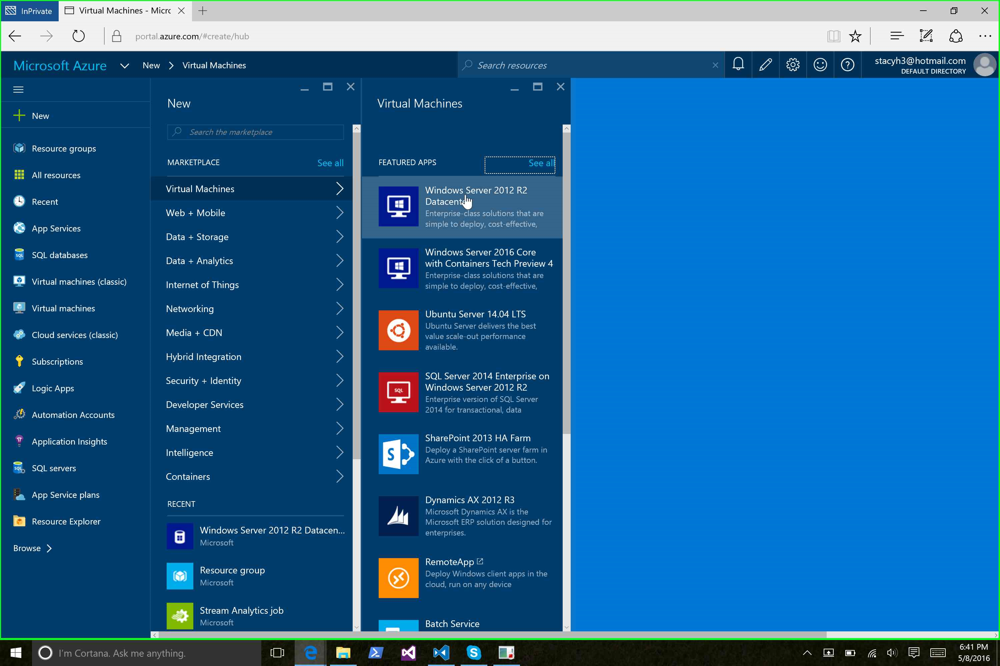

Make sure that the *Deployment Mode* is set to *Resource Manager* then
click *Create*

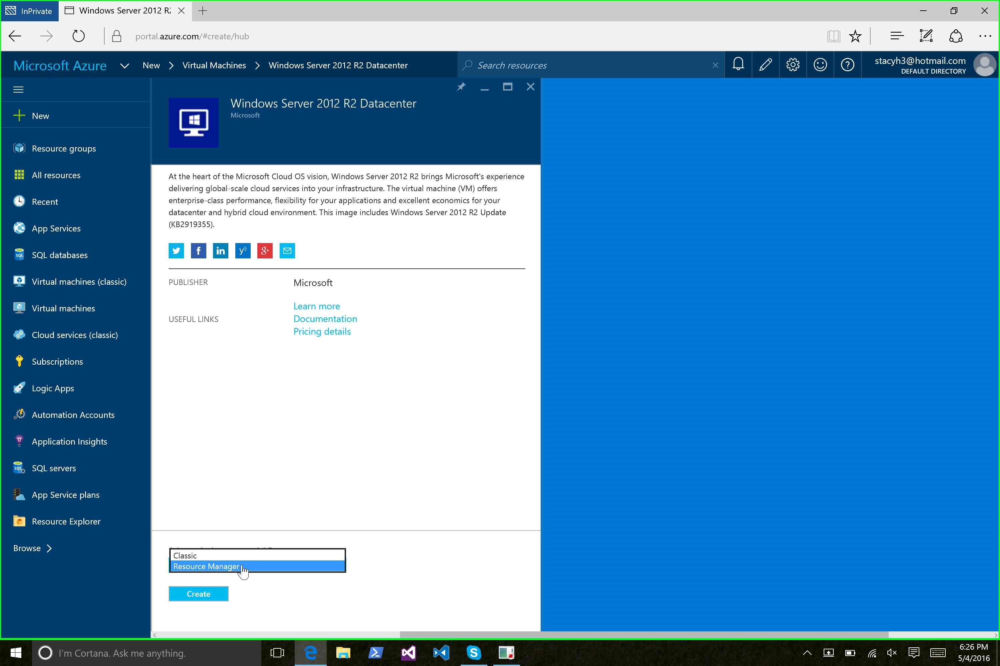

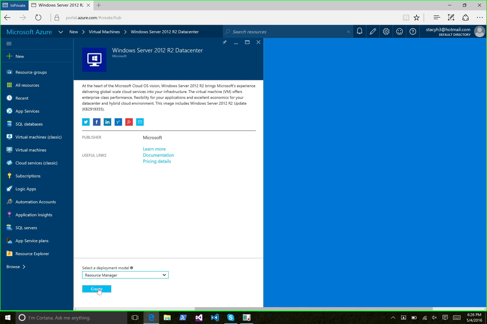

## 2. Basics
In the next series of steps, we’ll build up the VM and the other
environmental components that it needs. First, let’s supply some basic
information:

-   **Name:** The name of the Virtual Machine

-   **User Name:** The name for the administrative user account on the Virtual Machine

-   **Password:** The password for the administrative user account on the Virtual Machine

-   **Subscription:** If you have multiple Azure subscriptions, you can choose which subscription to use for this deployment

-   **Resource Group:** The name of the Resource Group into which the Virtual Machine will be deployed

-   **Location:** The data center where your resources will be deployed

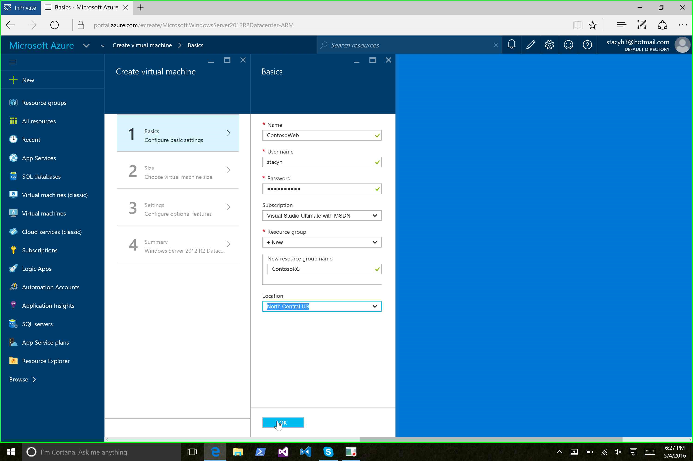

## 3. Size
Next choose the size of the VM. There are some recommended VM sizes, but let's click *View All* so that we can pick a *Basic* VM.

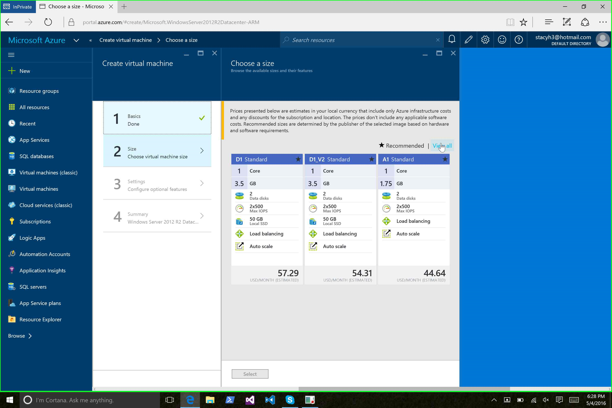

Scroll down and select the *A0* VM size and click *Select*

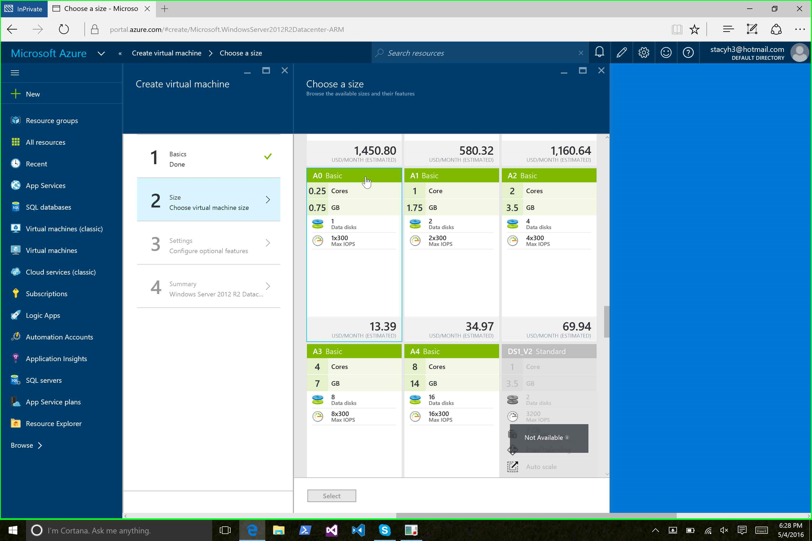

## 4. Settings/Optional Features
### Storage
* Note that you can select *Standard* hard drives or *SSD* storage. For now, let's stick with *Standard* storage.
* Click *Storage account*. If this is the first time you're creating a VM, you'll be able to create a new storage account here. Give the storage account a unique name and choose *Standard_LRS* for the type of storage.

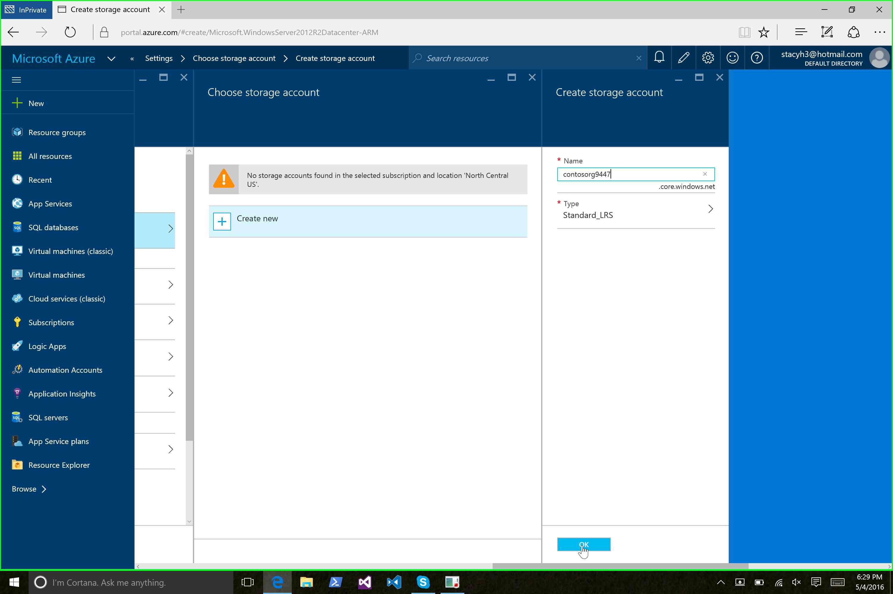
 
### Network
 * Select *Virtual network*
 * Select *Create new*
 * Supply a name for your virtual network
 * Use the default *Address space* of 10.0.0.0/16
 * For the *Subnet name* use *default*
 * For the *Subnet address range* use 10.0.0.0/24

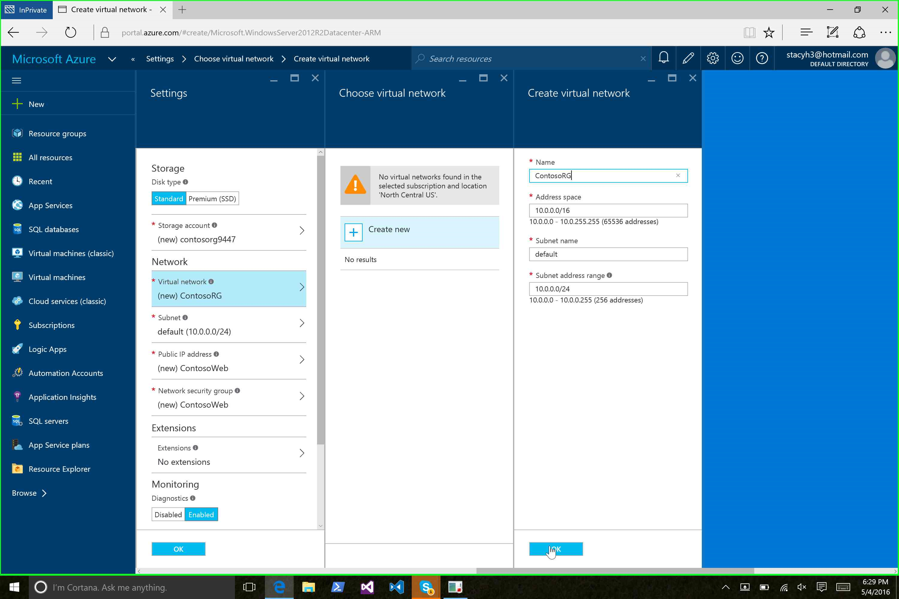

 * Click *Public IP address* and type in a name for the IP address. Leave Assignment set to *Dynamic*.

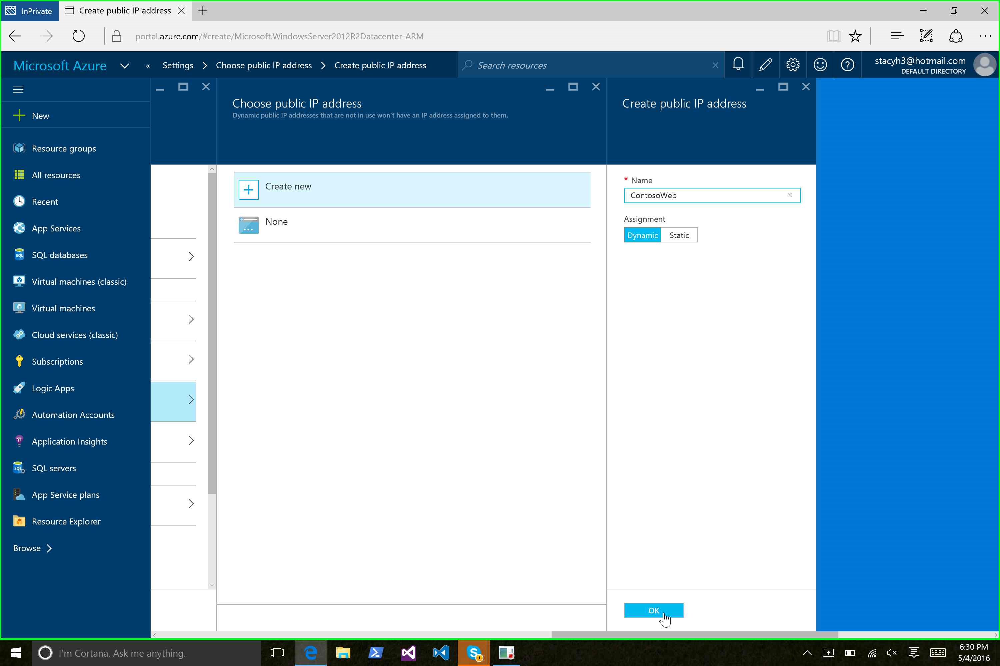

 * Click *Network security group*

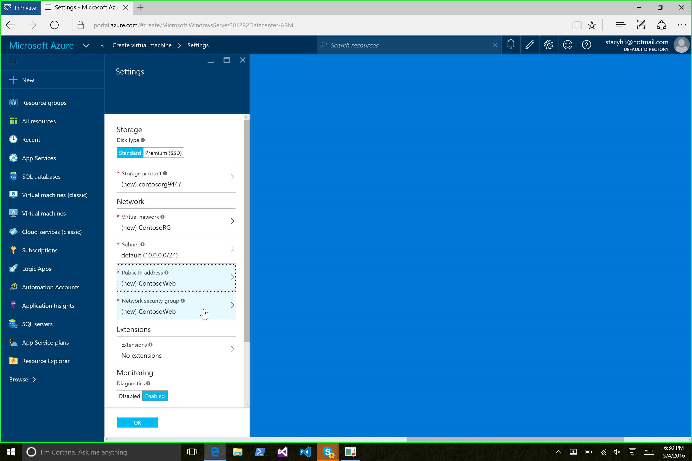

* Type in a name for the *Network security group*
* Click *OK*

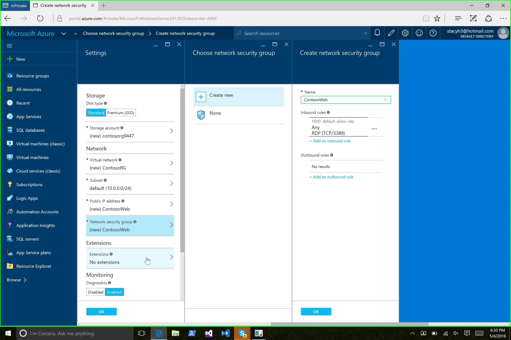

### Extensions
* Click *Extensions*
* For now, we'll leave this blank, but note that you can add extensions to the VM image. These extensions can be for monitoring, configuration, or other aspects of virtual machine management.
* Click *OK*

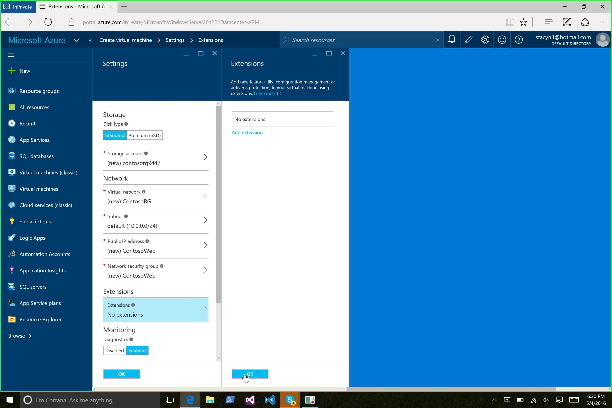

* Click *OK* to complete settings.

### Monitoring
* Leave monitoring set to the default 

### Finish
* Click *OK* to create your virtual machine.

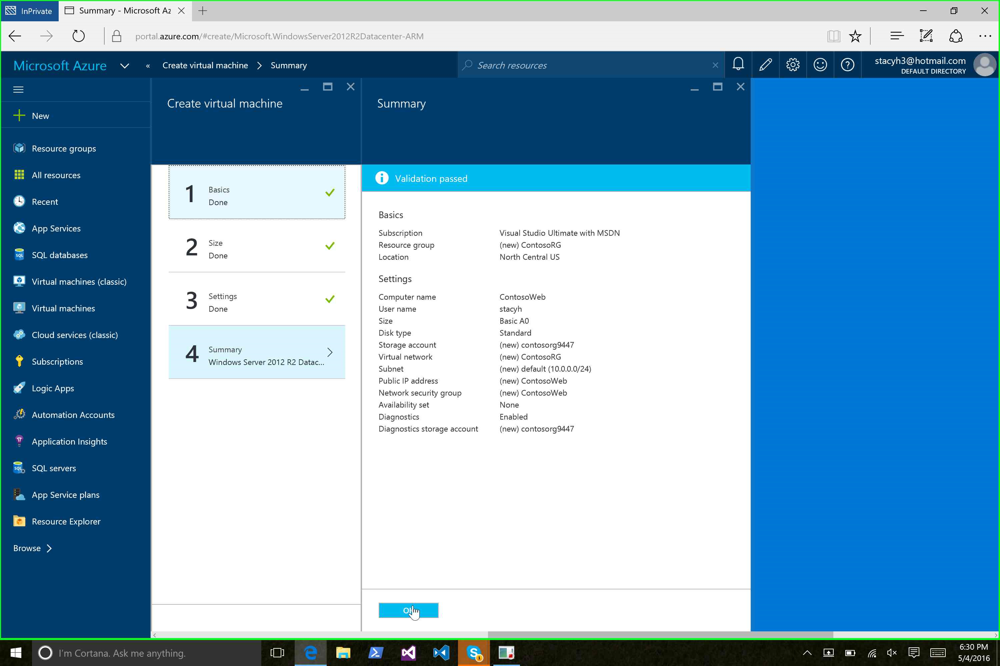

Creating a VM can easily take 15-20 minutes to complete. You can watch the progress in the Azure Portal.

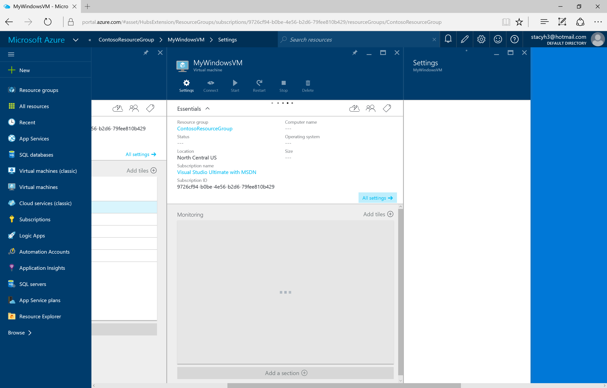
Once your VM has been deployed, you can connect to the VM via *Remote Desktop* by clicking the *Connect* button in the Azure Portal.