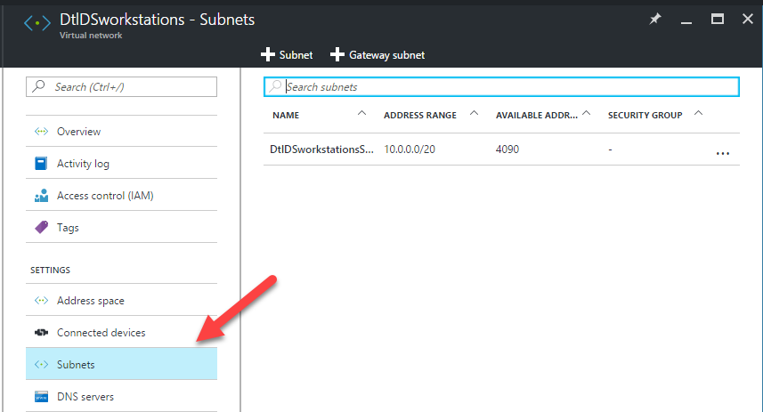

# Creating an Azure Virtual Network

This lab will walk you through creating an Azure Virtual Network.
An Azure virtual network (VNet) is a representation of your own network in the cloud. 
You can control your Azure network settings and define DHCP address blocks, DNS settings, security policies, and routing.

## 1. Start
* On the left hand side of the Azure portal click "+New"
* Click "Networking" and then Click "Virtual Network"

* Click "Create"

* Enter Name, Address Space, Subnet Name, Address Range, Subscription, Resource Group, and Location.

## 2. Setup FrontEnd Subnet and Backend Subnet
* Open up the VNET you just created
* Click Subnets 

* Click "+Subnet"

* Enter Name, Address Range, leave Network Security Group and Route to "None"

* Click "+Subnet"

* Enter Name, Address Range, leave Network Security Group and Route to "None"
